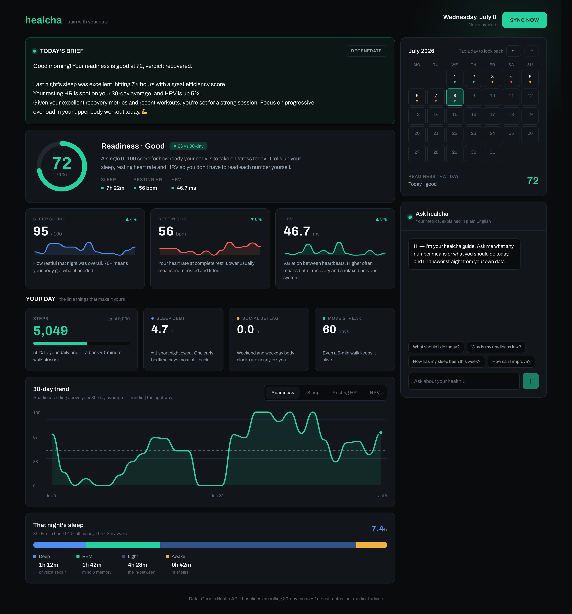
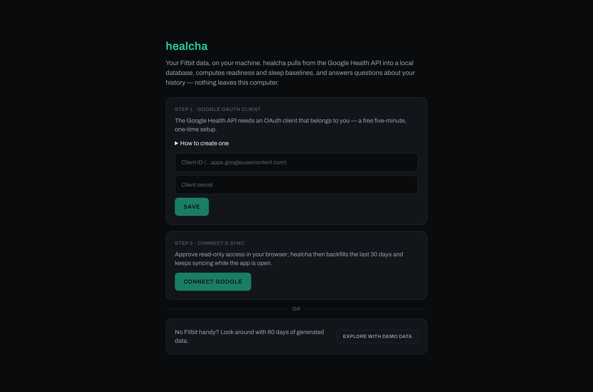
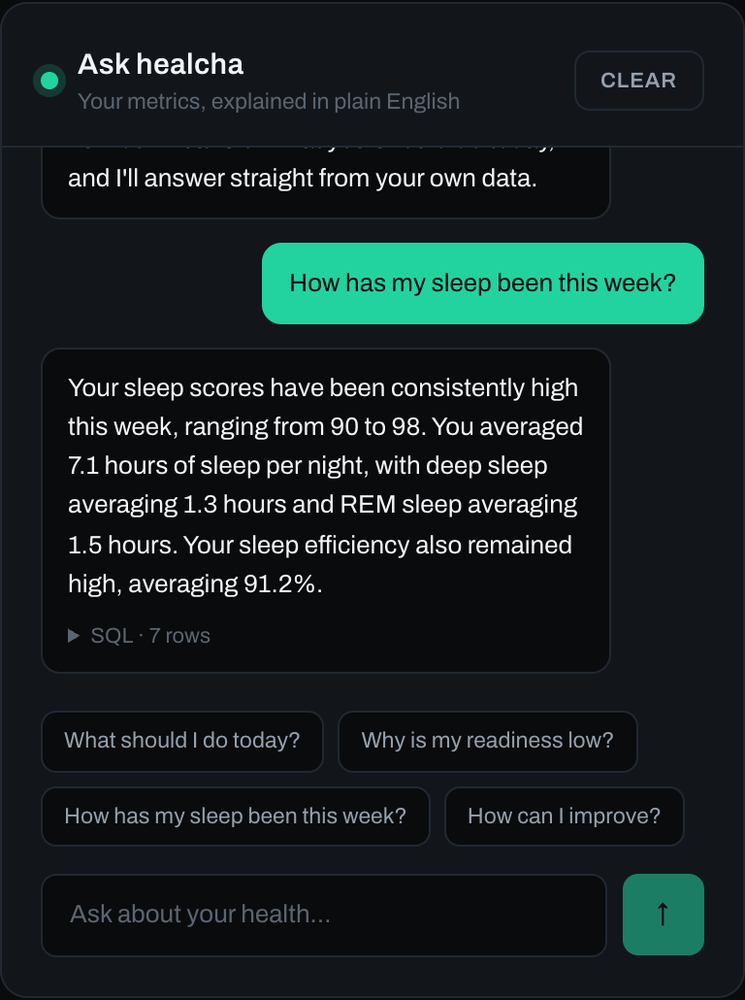
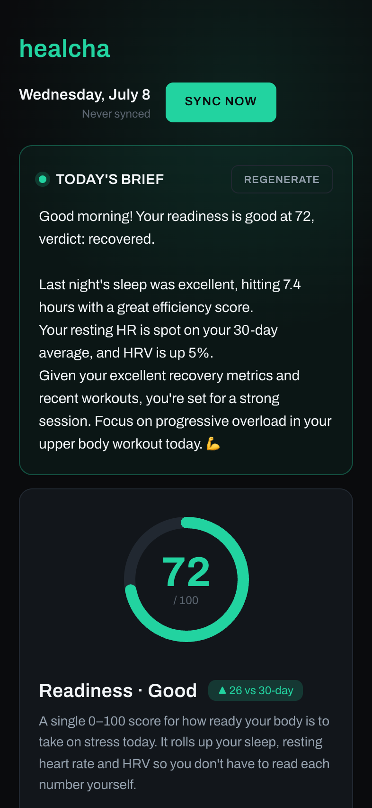

# healcha — your Fitbit data, on your machine

A local-first desktop app for Fitbit (Fitbit Air / Pixel Watch) health data.
It pulls from the **Google Health API** (`health.googleapis.com/v4` — the
replacement for the legacy Fitbit Web API, which this project never touches)
into a **SQLite file on your disk**, computes rolling personal baselines,
readiness and sleep scores, and answers **plain-English questions** about your
history through a guarded read-only text-to-SQL pipeline. The AI runs on a
**local model via Ollama** by default — after a sync, everything works with
no cloud services and no accounts.

<p align="center">
  
</p>

<sub>Every screenshot in this README shows synthetic data from the built-in
demo seed — no real health data lives in this repo.</sub>

```
healcha.app (Tauri shell)
   └─ webview ──▶ local Next.js server ──▶ SQLite (app-data dir)
                      ├─▶ Google Health API   (sync, when online)
                      └─▶ Ollama at localhost (brief + chat)
```

Key design points:

- **One pull function.** `src/lib/sync/syncHealthData.ts` is the only
  ingestion path — the Sync button, the automatic refresh and the CLI all call
  it. Incremental (per-type `sync_state`, 1-day overlap) and idempotent
  (upserts on natural keys — run it twice, no dupes).
- **Two-tier storage.** Raw intraday tables (heart rate at ~5s resolution,
  SpO2, steps, HRV) plus a small indexed `metrics_daily` rollup that the
  dashboard and the AI read by default.
- **Baseline-relative.** Rolling 30-day mean/σ per key metric; everything
  user-facing is expressed as deviation from *your* baseline. The API exposes
  no readiness/cardio-load or sleep score, so both are computed locally
  (`src/lib/baseline.ts`) from HRV/RHR/sleep z-scores.
- **Read-only AI SQL.** Generated SQL must be a single SELECT/WITH statement,
  mutation keywords are rejected, rows are capped at 200 (`textToSql.ts`).
- **Local-first.** Database, config and the auto-generated token-encryption
  key live in one data directory. Nothing leaves your machine except the
  Google sync itself (and the LLM call, if you opt into a cloud provider).

---

## Quick start

The fastest path is a packaged build from
[**Releases**](https://github.com/dabarov/healcha/releases) — self-contained
(Node runtime included), nothing to install. The builds are unsigned, so on
macOS right-click → Open the first time (or
`xattr -dr com.apple.quarantine healcha.app`).

To run from source you'll need **Node.js 20+**, and for the desktop shell a
**Rust toolchain** ([rustup.rs](https://rustup.rs)) plus [Tauri's system
dependencies](https://tauri.app/start/prerequisites/) (on macOS just the
Xcode command-line tools).

```sh
git clone git@github.com:dabarov/healcha.git && cd healcha
npm install
npm run app        # opens the desktop window
```

Prefer the browser, or don't want Rust? The same app runs as a plain local
web app:

```sh
npm run dev        # http://localhost:3000
```

Either way, the first run walks you through setup — or skips it entirely:

<p align="center">
  
</p>

**No Fitbit handy?** Click *Explore with demo data* and the app seeds 60 days
of plausible generated data so you can try everything immediately.

`npm run app:build` produces an installable bundle for your platform under
`src-tauri/target/release/bundle/`, with a Node runtime bundled in so the
result runs on machines without Node. Pushing a `v*` tag builds
macOS (Intel + Apple silicon), Windows and Linux artifacts and drafts a
GitHub release with them (`.github/workflows/release.yml`).

## Connecting your Fitbit

The Google Health API requires an OAuth client of your own — a free, one-time,
~five-minute setup (the app shows these steps inline too):

1. [console.cloud.google.com](https://console.cloud.google.com) → create a
   project → **APIs & Services → Library** → enable the **Health API**.
2. **OAuth consent screen**: user type **External**, publishing status
   **Testing** (no security review needed for personal use), and add your own
   Google account as a test user.
3. **Credentials → Create credentials → OAuth client ID** → type **Web
   application**, redirect URI as shown on the setup screen
   (`http://localhost:4823/api/auth/google/callback` for the desktop app).
4. Make sure your Fitbit account is linked to that Google account (Fitbit
   app → profile → linked Google account) — the Health API serves the data of
   the Google account that authorizes.

Paste the client ID + secret into the setup screen, hit **Connect Google**,
and approve access in the browser window that opens (Google blocks OAuth
inside embedded webviews, so the flow runs in your default browser). healcha
backfills the last 30 days (`SYNC_LOOKBACK_DAYS`) and re-syncs every few hours
while the app is open, plus whenever you hit **Sync now**.

Because the OAuth app stays in Testing mode, Google occasionally expires the
refresh token — the Sync button then turns into **Reconnect Google**; one
click and you're back.

## The AI

The daily brief and the chat use one provider chain (`src/lib/ai/llm.ts`):

- **Ollama first** — free and private (`ollama pull qwen3`; model/endpoint via
  `OLLAMA_MODEL` / `OLLAMA_BASE_URL`). qwen3 8B generates valid SQL quickly;
  bigger models haven't proven more reliable here.
- If Ollama is unreachable: **Gemini** when `GEMINI_API_KEY` is set (free tier
  via [aistudio.google.com/apikey](https://aistudio.google.com/apikey)), else
  **Anthropic** (`ANTHROPIC_API_KEY`).
- Force one with `LLM_PROVIDER=ollama|gemini|anthropic`.

Without any LLM available, sync and the whole dashboard still work — only the
brief text and the chat answers need one.

## Using it

The dashboard is one dark, single-screen "sporty" UI (design tokens in
[`DESIGN.md`](DESIGN.md)), everything baseline-relative and computed locally.
The calendar **time-travels the whole page**: tap any past day and the brief,
readiness ring, metric cards, sparklines and sleep card all re-point to it.

- **Today's brief** — the AI daily summary, cached per date, with one-click
  regenerate.
- **Readiness hero** — animated 0–100 ring, plain-English verdict
  (Prime / Good / Fair / Take it easy), delta vs your 30-day baseline, and the
  three drivers (sleep, resting HR, HRV) with status dots.
- **Metric cards** — sleep score, resting HR, HRV: value, %-vs-baseline delta,
  14-day sparkline and a jargon-free one-liner explaining the number.
- **Your day** — steps vs goal (`STEPS_GOAL`, default 9000), plus fun stats:
  14-night **sleep debt**, **social jetlag**, and your **move streak**.
- **30-day trend** — tabbed readiness / sleep / resting-HR / HRV chart with a
  dashed personal-mean line.
- **That night's sleep** — stage bar + legend when the device reports stages,
  otherwise bed/wake times, duration and efficiency.
- **Ask healcha** — an inline chat over the guarded text-to-SQL pipeline, with
  suggestion chips and an expandable SQL disclosure. Also available from the
  terminal: `npm run ask -- "worst sleep nights this month?"`.

<p align="center">
  
  
</p>

## Data & privacy

Everything lives in one directory: `healcha.db` (SQLite) and `config.json`
(Google OAuth client, auto-generated AES-256 key that encrypts the refresh
token at rest).

- Desktop app: the OS app-data dir (macOS:
  `~/Library/Application Support/com.dabarov.healcha`).
- Repo checkout (`npm run dev`, CLI scripts): `./local/data` (gitignored).
- Override with `HEALCHA_DATA_DIR`, or point `TURSO_DATABASE_URL` at any
  libsql URL — including a remote [Turso](https://turso.tech) database if you
  *want* your data in the cloud.

A `.env` file is entirely optional; see [`.env.example`](.env.example) for
every knob (timezone, step goal, age for HR zones, sync lookback, ports).

## Repo map

```
src-tauri/          desktop shell: spawns the local server, opens the window
src/app/            Next.js dashboard + local API routes
src/components/     dashboard/ UI cards · onboarding/ first-run flow
src/db/             Drizzle schema + libsql client     drizzle/  SQL migrations
src/lib/google/     OAuth + Health API client (pagination, civil-time filters)
src/lib/sync/       syncHealthData() — the single ingestion path
src/lib/baseline.ts rolling baselines, readiness + sleep-score computation
src/lib/derived.ts  derived metrics (sleep debt, ACWR, HR zones, strain) + sources
src/lib/ai/         provider chain, daily-brief generator, text-to-SQL
src/lib/config.ts   data dir, config.json, encryption key
scripts/            CLI: sync, seed-demo, ask
DESIGN.md           UI style reference (dark "sporty" design tokens + motion)
```

## Notes & known caveats

- **Payload defensiveness.** The Health API is new; exact JSON field names for
  some data types (rollup values, HRV samples, exercise metadata) are parsed
  defensively (`deepFindNumber`, camel/snake filter fallback in
  `healthApi.ts`). If a type errors, check `sync_state.last_error` — the fix
  is usually a one-line key rename in `syncHealthData.ts`.
- **Readiness & sleep score are computed, not Fitbit's** — the API doesn't
  expose readiness/cardio-load or sleep score. Formulas in `src/lib/baseline.ts`.
- **Release builds are unsigned** — macOS quarantines downloaded unsigned
  apps (right-click → Open once), and Windows SmartScreen shows a warning.
  Code signing needs paid certificates; building from source sidesteps both.
- The Tauri window and the browser mode serve the same app; anything you can
  do in one works in the other.

## Contributing

Contributions are welcome — see [CONTRIBUTING.md](CONTRIBUTING.md) for setup
and PR expectations. CI runs `typecheck`, tests, and the build on every pull
request. Security issues should go through
[private vulnerability reporting](SECURITY.md), not public issues.

## License

MIT — see [LICENSE](LICENSE).
